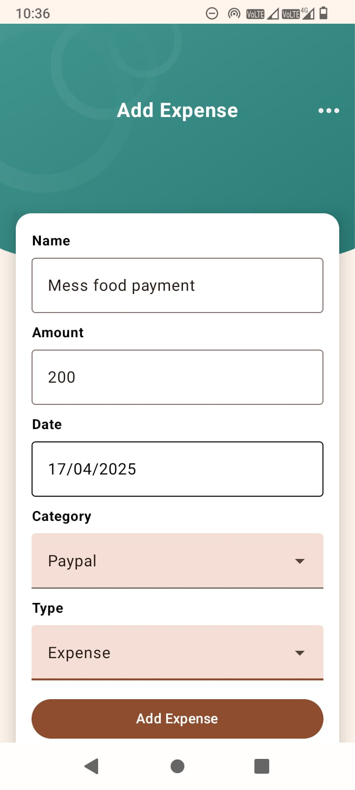
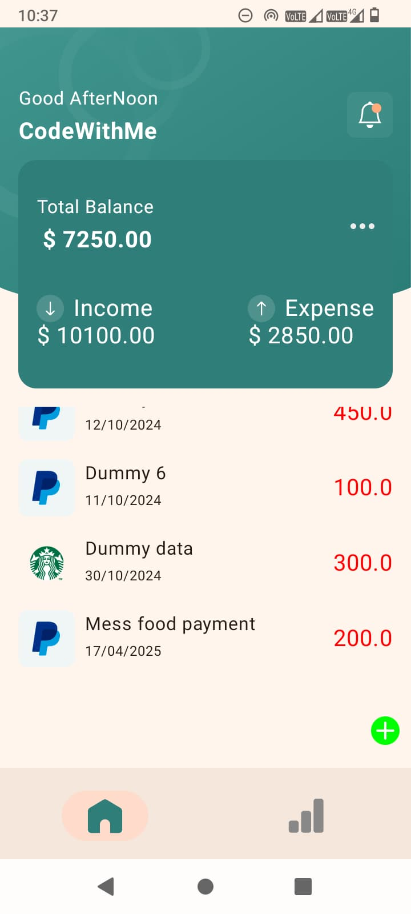
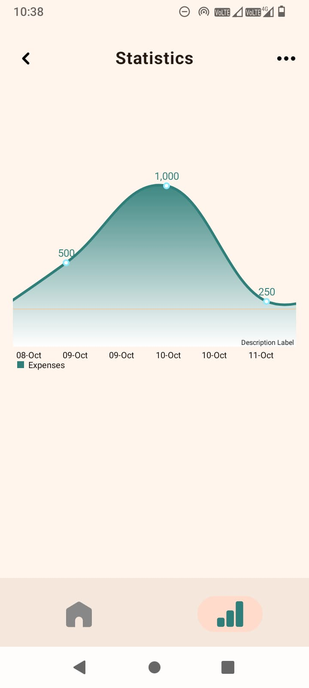

# 📊 Expense Tracker App

This is a **personal expense tracking Android app** built using **Kotlin**, **Jetpack Compose**, and **MVVM architecture** with **Room Database** for offline storage. It helps users manage their income and expenses, visualize data through graphs, and stay on top of their finances.

---

## ✨ Features

- 📅 Add expenses and incomes with a custom date picker.
- 🧾 Categorize your transactions (like food, Paypal, etc.).
- 📊 Visualize your expenses using graphs.
- 💰 See your total balance, total income, and total expenses at a glance.
- 💾 All data is stored locally using Room DB — no internet needed.

---

## 🛠️ Tech Stack

- **Kotlin**
- **Jetpack Compose**
- **MVVM Architecture**
- **Room Database**
- **Material Design UI**

---

## 📸 Screenshots

### ➕ Add Expense

### 🏠 Home Dashboard

### 📈 Expense Graph

